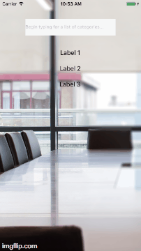

# ti.suggestions
#### Titanium Axway Suggestions
As a user types text into TextField - this widget filters the array/results and populates a TableView Overlay



###### index.xml
```xml
<Widget id="categorySearchTextField" hintText="Begin typing for a list of categories..." src="ti.suggestions" onChange="handleChange" onExportData="handleExportData" onClear="handleClear" />
```

###### index.js
```javascript
var categoriesArrayData =
    [{title: "Action Book [Books]", id: 1},
    {title: "Dog Food [Pet Supplies]", id: 2},
    {title: "Guitar [Musical Instruments]", id: 3},
    {title: "Refrigerator [Appliances]", id: 4},
    {title: "Xylophone [Musical Instruments]", id: 5}];

// SEND REQUEST TO GET NEW DATA
function handleChange(e) {			//e.value
    //Ti.API.info("Value Changed: " + $.categorySearchTextField.getValue());

    var filteredArray =
        _.filter(categoriesArrayData, function(element){
            return element.title.toLowerCase().indexOf( e.value.toLowerCase() ) > -1;
    });

    $.categorySearchTextField.setSuggestions(filteredArray);
}

// HANDLE RETURNED DATA WHEN USER CLICKED ON A SUGGESTION ROW
function handleExportData(data) {
    Ti.API.info("User clicked: " + JSON.stringify(data));
}

//HANDLE WHEN TEXTFIELD IS CLEARED
function handleClear(){
	//Ti.API.info("Value Cleared");
}
```

###### index.tss
```stylesheet
"#categorySearchTextField": {
  font: { fontSize: 12 },
  color: "#545454",
  backgroundColor: "#F7f7f7",
  width: "80%",
  height: 44,
  top: 50,
    clearButtonMode : Titanium.UI.INPUT_BUTTONMODE_ONFOCUS,
    returnKeyType: Titanium.UI.RETURNKEY_SEARCH,
    zIndex: 1,
    suggestions: {
        bottom : 15,
        height: Ti.UI.SIZE,
        width: "80%",
        visible : false,
        opacity : 0,
        zIndex: 10
    }
}
```
